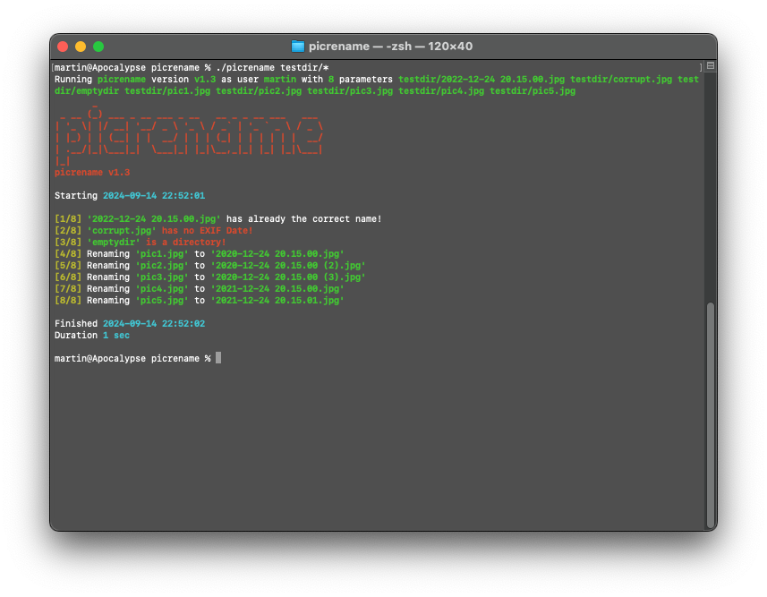

# picrename (Rename pictures to EXIF date)

## Description

This script renames pictures to their EXIF date.

## Screenshot



## Usage

```Bash
#> ./picrename file1 file2 ...
```

## Background

The commandlinetool "exiftool" is used to get the creation date and time of the given picture. Then the picture is renamed with this date and time as filename. If the exact date and time is already used, a number will be attached to the filename.

## Development

The script "runtests" generates the directory "testdir" with some testfiles and runs the script on this directory.

```Bash
#> ./runtests
```

## License

MIT License, see "License.txt".

## Author

By domo
